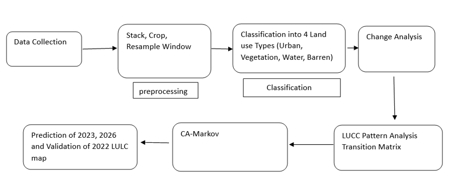

## Project Objectives

The objective of the Land Use/Land Cover (LULC) Change Detection project in Prayagraj is to assess and analyze the spatial and temporal changes in land use patterns using satellite imagery and remote sensing techniques. The project aims to identify and quantify the transformation of various land cover types, including urban areas, vegetation, water bodies, and agricultural lands, over a specific period. By employing advanced image classification and geospatial analysis methods, the project seeks to detect trends such as urban expansion, deforestation, and changes in water bodies. These insights will contribute to understanding the environmental impact of land use transitions and help guide sustainable urban planning and resource management. Ultimately, the findings will inform policymakers and urban planners in developing strategies that promote sustainable development while addressing the ecological and socio-economic challenges in the Prayagraj region.

## Flowchart :

    

### The UNET model was trained upon two types of satellite images:

* [Sentinel-2-MSI-1C](Sentinel-2-MSI-1C:4-bands)
* [Sentinel-1-SAR](Sentinel-1-SAR:1-band)
* https://landsat.gsfc.nasa.gov/satellites/landsat-8/

#### For more details about the methodology and results, refer to the [project report](Report.pdf)
